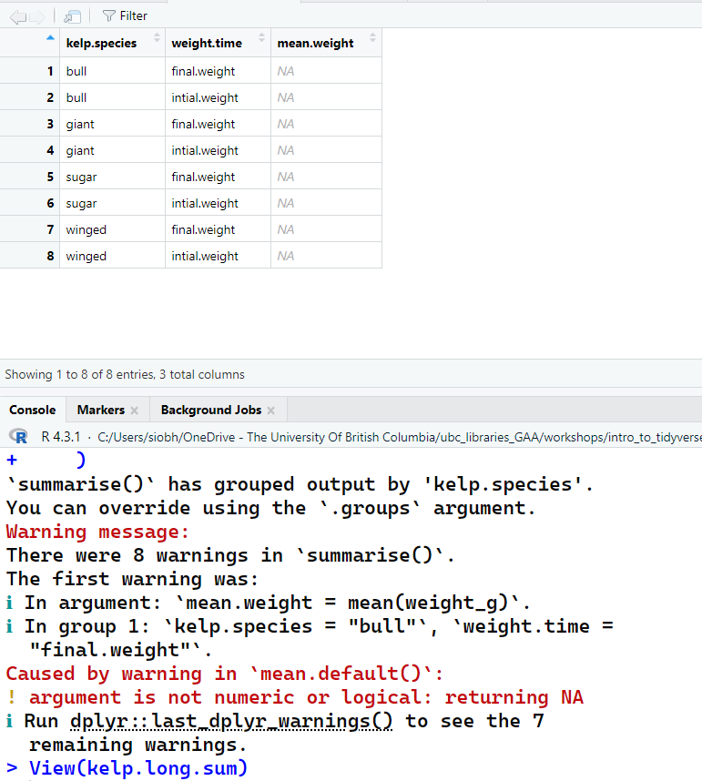

# Common Errors in Tidyverse

For the last bit of this workshop, we will go over some common errors that happen when manipulating data. Let's make a dataframe to work with. This example is with intial and final wet weights after 1 week of growth of different kelp species.

```r
## parts of the dataframe
kelp.id = c("s1", "s2", "s3", "w1", "w2", "g1", "g2", "g3", "b1", "b2")
kelp.species = c("sugar", "sugar", "sugar", "winged", "winged", "giant", "giant", "giant", "bull", "bull")
intial.weight = c("2", "2", "3", "4", "4", "10", "11", "11", "9", "9")
final.weight = c("4", "4", "6", "10", "12", "not.rec", "20", "25", "not.rec", "15")

## make the dataframe
kelp = data.frame(kelp.id, kelp.species, intial.weight, final.weight)

## replace the not reccorded (not.rec) data with NA 
kelp[kelp == "not.rec"] <- NA
```

Let's pivot these data longer to make analysis easier

```r
kelp.long = kelp %>% 
  pivot_longer(cols = c(3:4),
               names_to = "weight.time", 
               values_to = "weight_g")
```

Let's say we want to string some operations together. Use that pipe!

```r
kelp.long.sum = kelp %>% 
  pivot_longer(cols = c(3:4),
               names_to = "weight.time", 
               values_to = "weight_g") %>%
  group_by(kelp.species, weight.time) %>%
  summarise(
    mean.weight = mean(weight_g),
    n.weight = length(weight_g),
    sum.weight = sum(weight_g))
  
```
<div style="margin-left: 5%; margin-top: 20px; margin-bottom: 40px">

</div>


Oh no! This is not what we wanted at all! Look at all those NAs in the dataframe (table above in image) and the error message (in the R console, below in image). What might be going on here?

The NAs are a clue. Look at the data type of the kelp weights. They are characters! You can't take the mean of a character!

Let's fix the variable type directly in our little pipe chain!

```r
kelp.long.sum = kelp %>% 
  pivot_longer(cols = c(3:4),
               names_to = "weight.time", 
               values_to = "weight_g") %>%
  group_by(kelp.species, weight.time) %>%
  summarise(
    mean.weight = mean(as.numeric(weight_g)),
    n.weight = length(as.numeric(weight_g)),
    sum.weight = sum(as.numeric(weight_g)))

# look at the data again
View(kelp.long.sum)
  
```

Here we have some data, but you can see that R does not like the missing data since it's not calculating the mean and sum of the weights when the groups contain NA values.

Let's add more to the pipe sequence!

```r
kelp.long.sum = kelp %>% 
  pivot_longer(cols = c(3:4),
               names_to = "weight.time", 
               values_to = "weight_g") %>%
  filter(!is.na(weight_g)) %>% 
  group_by(kelp.species, weight.time) %>%
  summarise(
    mean.weight = mean(as.numeric(weight_g)),
    n.weight = length(as.numeric(weight_g)),
    sum.weight = sum(as.numeric(weight_g)))

View(kelp.long.sum)
```

This looks better! We kept all our data and computed the summary statistics we wanted.

Fixing one issue and building up until the next problem arises is the best way to build code.

In tidyverse (and R in general), one of the most **common reasons to get errors is that the data are the wrong type**. Here, the weights were characters but had to be numeric.
