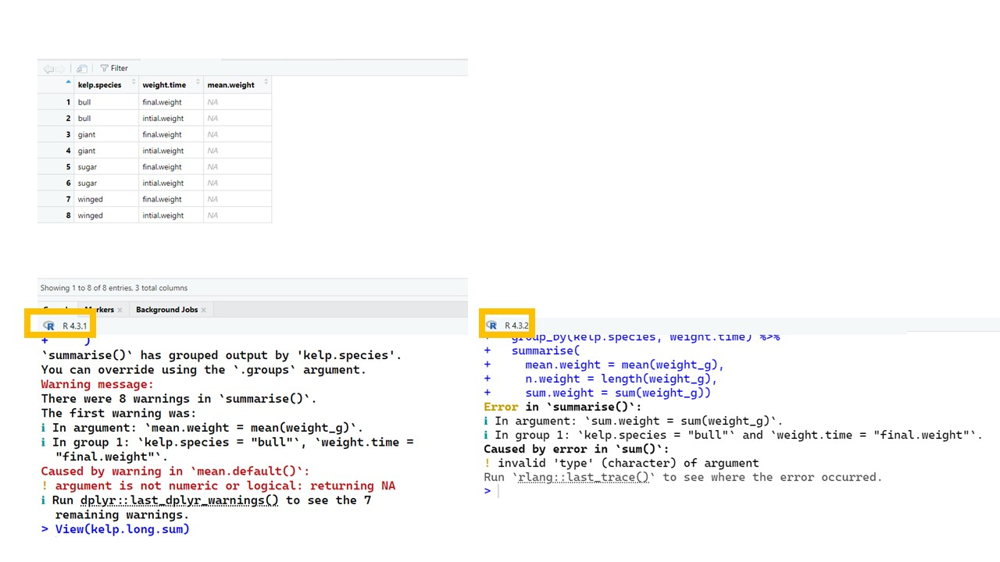

# Common Errors in Tidyverse

For the last bit of this workshop, we will go over some common errors that happen when manipulating data. Let's make a dataframe to work with. This example tracks scheduled and actual flight durations (in hours) for different aircraft types.

```r
## parts of the dataframe
flight.id = c("a1", "a2", "a3", "b1", "b2", "c1", "c2", "c3", "d1", "d2")
aircraft.type = c("Boeing 737", "Boeing 737", "Boeing 737", "Airbus A320", "Airbus A320", "Boeing 777", "Boeing 777", "Boeing 777", "Airbus A350", "Airbus A350")
scheduled.hrs = c("2", "3", "2", "5", "5", "10", "11", "11", "9", "9")
actual.hrs = c("2", "3", "3", "6", "5", "not.rec", "12", "12", "not.rec", "10")

## make the dataframe
flights = data.frame(flight.id, aircraft.type, scheduled.hrs, actual.hrs)

## replace the not recorded (not.rec) data with NA
flights[flights == "not.rec"] <- NA
```

Let's pivot these data longer to make analysis easier

```r
flights.long = flights -> 
  pivot_longer(cols = c(3:4),
               names_to = "duration.type", 
               values_to = "hours")
```

Let's say we want to string some operations together. Use that pipe!

```r
## the library plyr is a good partner to the library tidyverse
# install.packages("plyr")
library(plyr)

flights.long.sum = flights -> 
  pivot_longer(cols = c(3:4), names_to = "duration.type", values_to = "hours") ->
  ddply(c("aircraft.type", "duration.type"),  ## ddply is part of plyr
        summarise,
    mean.hours = mean(hours),
    n.flights = length(hours),
    sum.hours = sum(hours))

  
```
<div style="margin-left: 5%; margin-top: 20px; margin-bottom: 40px">

</div>


Oh no! This is not what we wanted at all! Look at all those NAs in the dataframe (table above in image) and the error message (in the R console, below in image). What might be going on here?

The NAs are a clue. Look at the data type of the flight hours. They are characters! You can't take the mean of a character!

Let's fix the variable type directly in our little pipe chain!

```r
flights.long.sum = flights ->
  pivot_longer(cols = c(3:4), names_to = "duration.type", values_to = "hours") ->
  filter(!is.na(hours)) -> ## removes missing values (NAs)
  ddply(c("aircraft.type", "duration.type"), ## groups by aircraft type and duration type
        summarise,
    mean.hours = mean(hours),
    n.flights = length(hours),
    sum.hours = sum(hours))
  
```

This seems like it should work but we are still getting the same error. Why is that? 


```r
flights.long.sum = flights ->
  pivot_longer(cols = c(3:4), names_to = "duration.type", values_to = "hours") ->
  filter(!is.na(hours)) -> ## removes missing values (NAs)
  ddply(c("aircraft.type", "duration.type"), ## groups by aircraft type and duration type
        summarise,
    mean.hours = mean(as.numeric(hours)), ## force hours to be numeric 
    n.flights = length(as.numeric(hours)),
    sum.hours = sum(as.numeric(hours)))

```

This looks better! We kept all our data and computed the summary statistics we wanted.

Fixing one issue and building up until the next problem arises is the best way to build code.

In tidyverse (and R in general), one of the most **common reasons to get errors is that the data are the wrong type**. Here, the flight hours were characters but had to be numeric. Often, numeric data will be converted to character data when transforming data, which is what `pivot_longer()` does.
