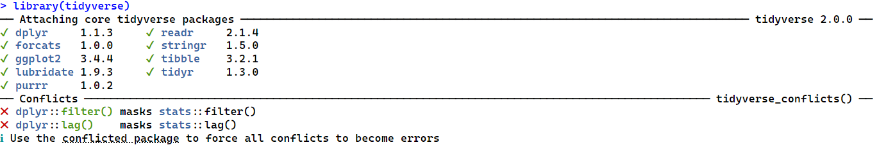

# Tidyverse Overview

## What is tidyverse?

R packages allow you to use additional functions that are not pre-programmed as part of base R.

The tidyverse package is a package of packages that allows users to load in common packages quickly, rather than one at a time.


*Source: [Tidyverse data wrangling](https://hbctraining.github.io/Intro-to-R/lessons/tidyverse_data_wrangling.html)*

### Why use tidyverse?

Tidyverse is very well maintained and has a very wide community of users. See their [site](https://www.tidyverse.org/) for information about their mission and for additional tutorials.

### Related workshops

There are other UBC Library workshops that might be of interest and are related to this one:

- [Relational data in R](https://ubc-library-rc.github.io/relational-data-r/)
- [Data manipulation with dplyr](https://ubc-library-rc.github.io/data-manipulation-dplyr/)
- [Data visualization with ggplot2](https://ubc-library-rc.github.io/ggplot2_intro_workshop/)

## Installing and loading tidyverse

Like every other R package, you have to install tidyverse with `install.packages("tidyverse")` the first time you use it, and then only load it with `library(tidyverse)` after that.


``` r
# install
install.packages("tidyverse")

# load for use
library(tidyverse)
```



After running the `library(tidyverse)` command, you will see some **core tidyverse packages** and some **conflicts** in your console.

{: .note }
It's okay to have conflicts most of the time. Today, we will focus on some of the core tidyverse packages.
