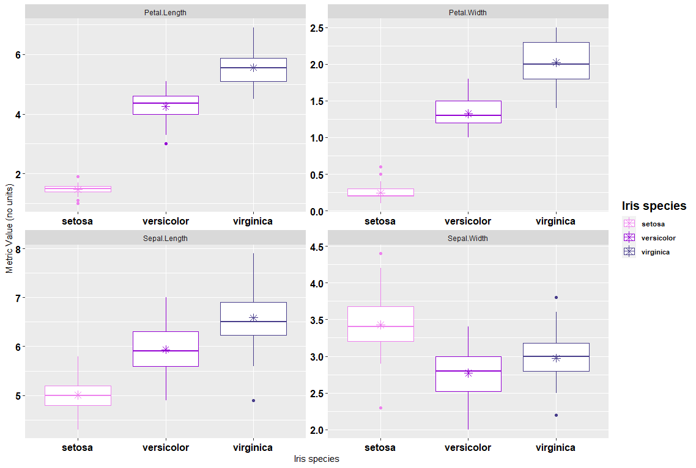
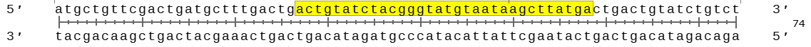

# Let's wrangle and plot some data

## tidyr

tidyr is a package that allows easy data manipulation. To see the full options and a tidyr cheat sheet, go to <https://tidyr.tidyverse.org>

Today, we will talk about pivoting data, which is an important first step before analyzing and plotting data sets.

We will work with the iris data

``` r
View(iris)
```

The iris data is currently in a "wide" format. Let's change it into a "long" format.  

``` r
# open the dataset to see what it looks like right now
View(iris)

# change to long format
iris.longer = iris %>% pivot_longer(cols=c(1:4), 
                                    names_to = "metric_name",
                                    values_to = "metric_value")

# open again to see what happened
View(iris.long)
# See how we went from 5 columns to 3?
```


## dplyr

dplyr is a package that helpls with summarizing data. For the full list of what that means go here <https://dplyr.tidyverse.org>

Let's say we want to find some means and sample numbers in the iris.long dataset

``` r
iris.summarised = iris.longer %>% 
  group_by(Species, metric_name) %>%
  summarise(
    sample.size = length(metric_value),
    metric.mean = mean(metric_value) 
    )
```

We are going to keep using dplyr and use a cheat to add the summarized data back into the longer iris dataset.

``` r
iris.full = full_join(iris.longer, iris.summarised)
```

How did this join work? Do you know of other joins?

## ggplot2

ggplot2 is is a plotting package that is highly customizable. For the full resources go here <https://ggplot2.tidyverse.org>

``` r
ggplot(iris.full, aes(x=Species))+
  geom_boxplot(aes(y=metric_value, color=Species))+
  geom_point(aes(y=metric.mean, color=Species), cex=3, pch=8)+
  facet_wrap(.~metric_name, scales="free")+
  scale_color_manual(values=c("#EE82EE", "#9400D3", "#483D8B"))+
  theme(axis.text = element_text(colour = "black", face = "bold", size = 12),
  legend.text = element_text(size = 8, face ="bold", colour ="black"),
  legend.title = element_text(size = 14, colour = "black", face = "bold"))+
  labs(x="Iris species", y="Metric Value (no units)", color="Iris species")
```

<div style="margin-left: 5%; margin-top: 20px; margin-bottom: 40px">

</div>


Spend the next 5 minutes removing and editing parts of this plot code to figure out what they do. Note down errors that you get and we can discuss them as a group!

## stringr and lubridate

stringr is a package that let's you easily manipulate character data. For the full resources go here [https://stringr.tidyverse.org](https://stringr.tidyverse.org/)

lubridate is meant to help R users format date and time data, which are actually a huge pain to work with in R. lubridate even lets you deal with extra annoying things, like daylights savings time in your multi-year datasets. For the full resources go here [https://lubridate.tidyverse.org](https://lubridate.tidyverse.org/)

Today, we are not exploring dates and times, but we are using the character vector manipulation part of lubridate. 

There are many reasons you may want to manipulate characters in your dataset. Some of them are more on the data formatting side, while others are to extract parts of your data for further manipulation or analysis. We will go over both now.

## stringr
### Data formatting (string)

Let's say we want to change the names of the iris species in our dataset to include the full common name of the iris.

``` r
iris$Species=str_replace(iris$Species, # to the Species column in the iris dataframe
            "virginica", # find the pattern "virginica"
            "Virginia blueflag") # replace the pattern "virginica" with "Virginia blueflag"
```

Repeat this activity with the *setosoa* iris in the iris dataset (answer below)

``` r
iris$Species=str_replace(iris$Species, 
            "setosa", 
            "bristle-pointed iris")
```

Let's do the same thing, but with the example that comes up when you type `?str_replace` in the R console.

``` r
fruits <- c("one apple", "two pears", "three bananas")
str_replace(fruits, # in fruits
            "[aeiou]", # find any of these letters
            "-") # replace the letters in the [] above with 
```

What differences in structure within the `str_replace` function do you notice between this example and the example we just ran through with the iris data? Hint, **iris** is a *dataframe* and **fruits** is a *vector.*

### Data extracting (stringr)

The changes we just made to the iris dataset names are cute, but they are too long. Let's use `str_sub` to extract the first 3 characters of the species name.

``` r
iris$Species.Short = str_sub(iris$Species,
                             start=1,
                             end=3)
```

Why might we want to do this? Lets say you have long strings of letters, like a DNA sequence. R only likes to match perfect matches to each other. Matching partial matches is hard, but R does have ways of doing this.

Let's pretend you have two datasets of DNA sequences, each with DNA sequences in them. Dataset 1, has sequences that are 74 letters (base pairs) long. Dataset 2, has sequences that are 32 letters long.

You know that many of these sequences are actually from the same organism, but R will not merge the 74 letter long sequences with the 32 letter long ones, because they are different lengths, so they can not be perfect matches by definition.

If we have an expectation that the 32 letter long sequences (yellow highlighted part) match the 74 letter long sequences (all the letters) starting at letter 27/74 up to 58/74 (see image below ehere yellow is the overlap region), we can use `str_sub` to only keep the region of the 74 letter long sequence that should match the 32 letter long sequence.



``` r
## make 74 letter DNA sequence vector
seq74 = c("atgctgttcgactgatgctttgactgactgtatctacgggtatgtaataagcttatgactgactgtatctgtct",
"atgctgttcgactgatgctttgactgactgtatctaccggtatgtaataagcttatgactgactgtatctgtct",
"atgctgttcgactgatgctttgactgaccgtatctacgggtatgtaataagcttatgactgactgtatctgtct",
"atgctgttcgactgatgctttgactgactgtatctacttgtatgtaataagcttatgactgactgtatctgtct",
"atgctgttcgactgatgctttgactgactgtatctacttctatgtaataagcttatgactgactgtatctgtct",
"atgctgttcgactgatgctttgactgactatatctacttgtatgtaataagcttatgactgactgtatctgtct")

## can you tell which of these matches the 32 letter sequence?
seq32 = c("actgtatctacgggtatgtaataagcttatga",
"actgtatctacgggtatgtattaagcttatga",
"actgtatctacgcgtatgtaataagcttatga")
```

With one sequence you can just use the search function (CTRL+f or CMD+f) but pretend you had hundreds of these. You need to do this another way.

For the sake of learning, let's see if we can merge these vectors without using `str_sub` to get the to be the same length. We are will use **lubridate**, with the function `intersect`.

``` r
sequences.that.match = intersect(seq74, seq32)
## no matches!! 
```

Now that we confirmed that the sequences need to be the same length to merge, let's format them with `str_sub`. 

``` r
seq74trim = str_sub(seq74,
                    start=27,
                    end=58)
```

Running `str_sub` created a new vector that will be able to merge with the shorter sequences because they will be the same length, so you can have perfect macthes.

``` r
sequences.that.match = intersect(seq74trim, seq32)
## 1 match now that the sequences are the same length!
```

The point of this example is to show why `str_sub` is different from `str_replace` . `str_sub` **counts** to extract information. `str_replace` looks for **perfect matches** and does something with those perfect matches.

In situations where you have different string of letters (like in many DNA sequences), using perfect matches to extract a subset of your data for further analysis, like merging with other DNA sequences, is not possible because it is not reasonable to type out hundreads of sequences manually and look for matches that way.


## What is a pipe? 

You will notice in our very first example we used the `%>%` symbol. This is called a pipe operator and it is part of the **magrittr** package. It is used through the tidyverse to string many operations together.

The library has another workshop, where we go over the pipe operator more in detail <https://ubc-library-rc.github.io/data-manipulation-dplyr/content/pipe.html>

R has built in keyboard shortcuts (CMD+Shift+M for MAC; CTRL+Shift+M for PC) to get the pipe orperator instead of actually typing out % > % every time. 


