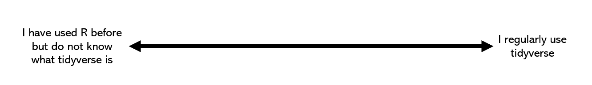

This workshop presents some of the major packages in the tidyverse package in R.

<strong>If you want to code along, make sure to have <a href="https://cran.r-project.org">R</a> and <a href="https://posit.co/download/rstudio-desktop/">RStudio</a> installed </strong>

## How familiar are you with R and tidyverse?

Indicate on screen with the annotate function in Zoom or in the chat.

## Learning objectives

At the end of this workshop, you will be able to: 
1. Know what tidyverse is.
2. Understand the uses of data manipulation packages.
3. Have an idea of where to start looking for answers when manipulating your data.

## What are we not learning today?

It is impossible to go through all packages in detail. We are providing only a small snippet of what each package in the tidyverse can do and we are leaving some packages out of this workshop entirely.

## Schedule

| 0:00 | Welcome and using Zoom|
| 0:05 | Introduction |
| 0:15 | Examples of packages in tidyverse|
| 0:45 | Common errors|
| 1:00 | Wrap-up and Discussion |

## Resources

<https://www.tidyverse.org/>{:target="_blank"}
